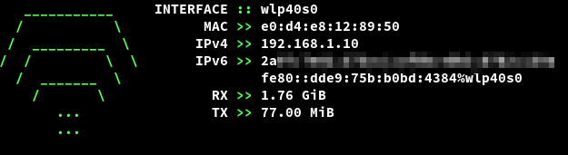
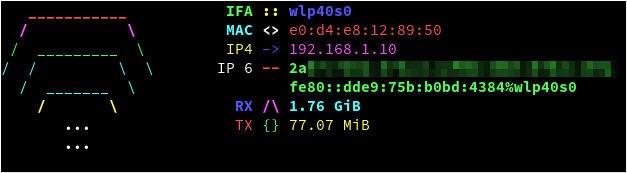

<b>IMPORTANT: READ THE 'SAFETY INFORMATION' PARAGRAPH</b>

<h2 align="center">ifetch</h2>

 

ifetch is a simple tool for Linux systems to display network interface information. You can currently install it from source in a few easy steps, and soon using a number of package managers.

### <b>Installation and removal</b>

* Download the source files from the latest release and extract them from the archive (or directly clone the repository)
* <code>cd</code> into the ifetch directory
* Execute the command <code>make install</code> as root (using <code>sudo</code> or analogous tools) if you want to install ifetch
* Execute the command <code>make uninstall</code> as root if you want to uninstall ifetch and keep the configuration options in the <code>/etc/ifetch/</code> directory
* Execute the command <code>make purge</code> as root if you want to remove the configuration options in the <code>/etc/ifetch/</code> directory

### <b>Safety information</b>
ifetch prints information relative to network interfaces, this includes the <b>IP addresses</b> they are assigned. These can be <b>private</b> or <b>public</b>, depending on your network setup.

<b>Make sure not to leak your public IP address(es)</b> if you are somehow sharing the output of ifetch (e.g. in a social media post, livestream, etc). If you don't know the difference between a public and private IP address, just hide the IP addresses data from the output using options in the configuration file or using the arguments passed through the command line.

I do not take any responsibility for any damage you might cause by leaking your public IP address(es) when sharing this software's output.
